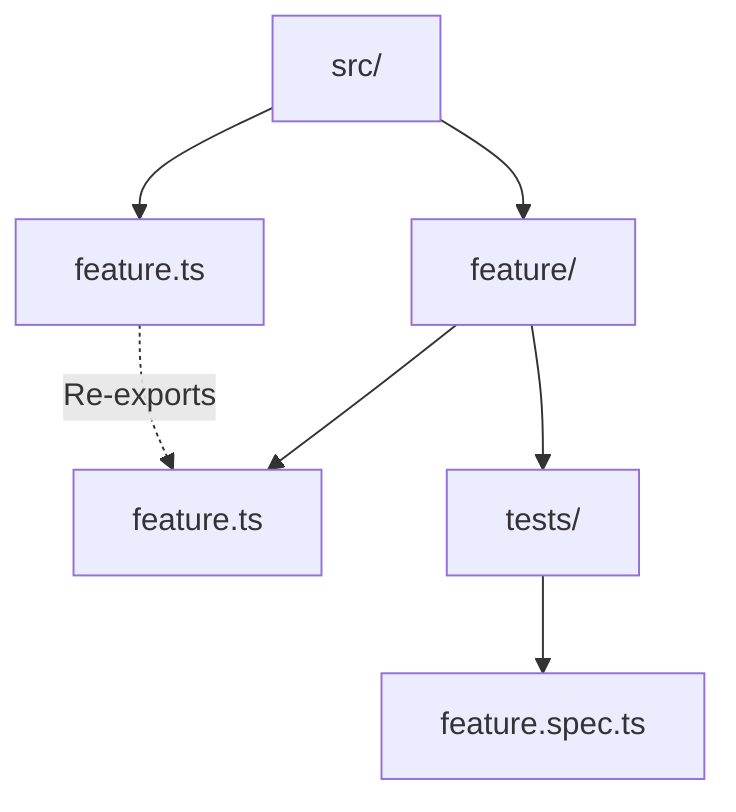

# Module Organization

**No index.ts** - Never use index files, they create implicit magic  
*Verify:* `find . -name 'index.ts'`  
*Fix:* Rename to feature name: `feature/index.ts` → `feature.ts` at parent level

**Explicit .ts extensions** - `import { x } from './file.ts'` not `'./file'`  
*Verify:* `grep "from '\./.*[^s]'" src/` (imports without .ts)  
*Fix:* Add `.ts` extension

**Re-export at boundaries** - Parent `feature.ts` re-exports from `feature/feature.ts`

**File organization within modules:**
- `feature.types.ts` - Type definitions only
- `feature.schemas.ts` - Zod schemas + `z.infer<>` types
- `feature.constants.ts` - Constants, error codes
- `feature.ts` - Main implementation

**Direct imports** - Import from specific files, not through re-exports within module  
*Verify:* Check for circular imports  
*Fix:* Import directly: `from './feature.types.ts'` not `from './feature.ts'`
